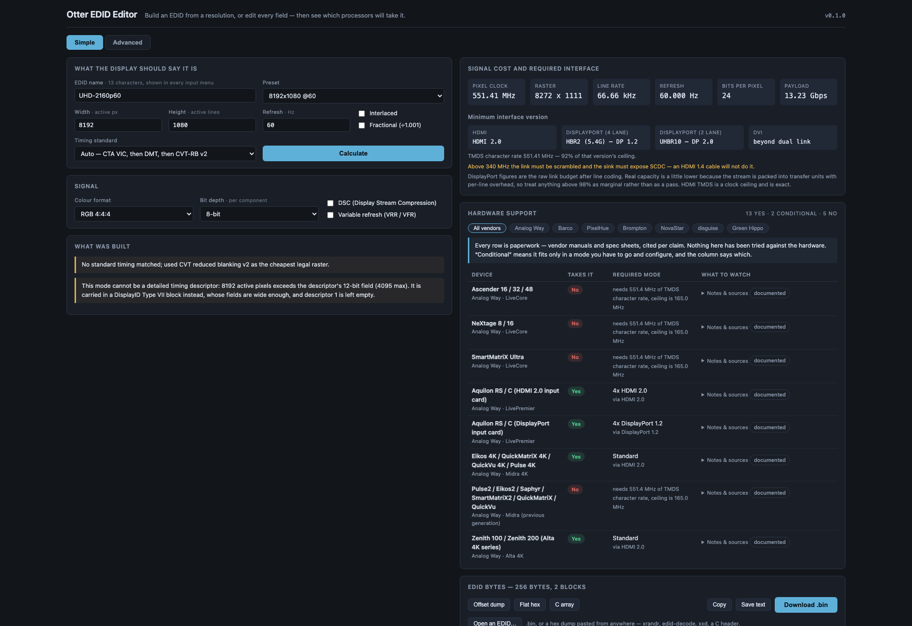

# Otter EDID Editor user guide

**A browser EDID editor for event video.** Build an EDID from a resolution and a refresh rate, or
edit every field by hand — then see **which processors will actually take it, and in which mode.**

Nothing is uploaded. There is no backend to upload it to.

> **Before you rely on this:** the timing engine is checked against published VESA DMT values, and
> the DisplayID layout against the Linux kernel's own parser.
>
> **The hardware table is vendor paperwork, cited per claim, and has not been tried against any
> hardware.** **No hardware has ever been fed an EDID this tool produced.** Treat a verdict as a
> shortlist.
>
> Built with AI assistance, directed and reviewed by a human author.

---

## Two modes

**Simple.** Type a resolution and a refresh rate, name it, press Calculate. You get a complete,
valid EDID 1.4: the mode as a detailed timing, a range-limits descriptor **sized to it**, the name
where every input menu will read it, and a CTA-861 extension carrying the VIC when the mode has
one.

**Advanced.** Every field. Identity, video input definition, chromaticity, established and standard
timings, all four descriptors, the CTA-861 extension — video and audio descriptors, HDMI and HDMI
Forum vendor blocks, HDR static metadata, colorimetry, 4:2:0 maps — and a DisplayID 2.0 extension.

Both modes name the EDID, and both show the same two answers on the right.

---

## The two answers

**What the mode costs, and the smallest interface that carries it.** Pixel clock, raster, line
rate, payload — then the minimum HDMI version (1.0–1.2, 1.3/1.4, 2.0, or which FRL rate), the
minimum DisplayPort rate at 4 and 2 lanes, and whether DVI needs one link or two.

**Which hardware takes it.** Twenty-one models across the major event-video vendors, each answering
**yes / conditional / no** — and **where the answer is conditional, the capacity mode you have to
configure to get it**:

- A **LiveCore dual-link input costs you the neighbouring input.**
- A **Barco E2 Gen 1** does 4K60 only across two cables.
- A **Barco E2 Gen 2 quad card** is four WQXGA inputs **or** two UHD60 ones.
- An **Aquilon DisplayPort card** is four DP 1.2 ports **or** two DP 1.4 ports — and **DP 1.4
  preempts ports 2 and 4.**

Every device carries its sources, quoted, with the date they were read. That is what to check
before a purchase decision rests on a row.

---

## DSC and variable refresh

Both are toggles, and **both are real**: they change the bandwidth arithmetic, they change which
interface version is required, and they are written into the EDID.

**Turning DSC on correctly makes every HDMI 2.0 and earlier input say no**, because DSC travels
only over a fixed-rate link. That is not the tool being pessimistic — it is the constraint.

---

## Import

Open a `.bin`, or paste a hex dump from anywhere — `xrandr`, `edid-decode`, `xxd`, a C header, a
bare hex string.

**A bad checksum is reported, not refused.** The dump off a misbehaving device is exactly when you
need to look at it, and a tool that refuses to open it is useless at the only moment it matters.

---

## If something is unexpected

| Symptom | Cause |
| --- | --- |
| **Every HDMI input says no after I enabled DSC** | Correct. DSC needs a fixed-rate link. |
| **A device says "conditional"** | It takes the mode only in a particular capacity mode — the answer names which. |
| **An imported EDID has a checksum error** | Reported deliberately rather than refused. Look at it. |
| **A verdict disagrees with a manufacturer** | Every row carries its source and the date it was read. Check it — the table is paperwork, not measurement. |
| **The processor rejected an EDID this built** | Possible, and untested — no hardware has ever been fed one of these. |

---

*Not affiliated with Analog Way, Barco, PixelHue, Brompton, NovaStar, disguise or Green Hippo.
Product names appear only to state compatibility.*
